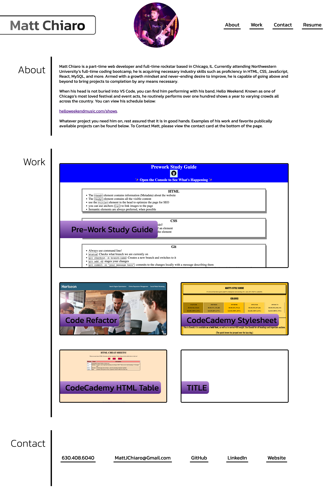
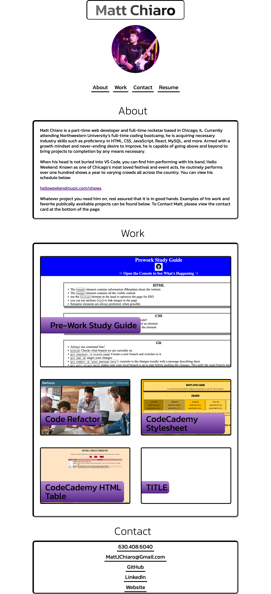
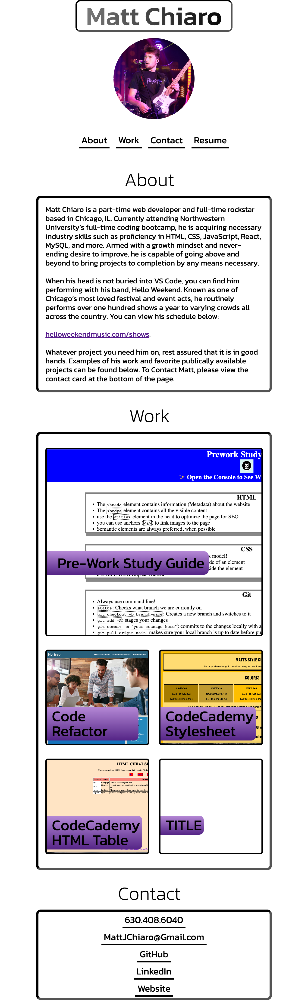

# Personal Portfolio

## Description

This is a personal portfolio website, written in HTML and CSS. It serves as a landing page for what I am currently up to in dev-land, as well as some of my favorite projects I have worked on thus far. 

If you need to contact me or reach out to me on any socials, this is the best place to find my most up to date contact information as well.

This webpage is fully scalable based on different media queries, so it will appear different on different sized viewports and devices. Examples are below.

## Installation

Project is live at https://mattchiaro.github.io/personal-portfolio/

## Usage

DESKTOP VERSION:

992PX AND UNDER:

625PX AND UNDER:

## Credits

CSS3 Bounce Animation (for the 'Contact Me' links) kindly borrowed from Neelam Khan on Stack Overflow:

https://stackoverflow.com/questions/40628410/trying-to-make-a-link-bounce-on-hover

Text gradient on h1 heading built using a tutorial from cssgradient.io:

https://cssgradient.io/blog/css-gradient-text/ 
